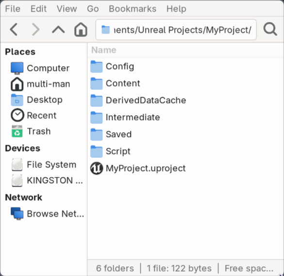

# unreal-linux-auto-open


Automatically opens `.uproject` files with the correct version of Unreal Engine on Linux.
Double-click on any `.uproject` — it detects the version and launches the right editor.



---

## Install

```bash
git clone https://github.com/MultiUpGame/unreal-linux-auto-open.git
cd unreal-linux-auto-open
bash install.sh
```

A folder picker will appear — select the folder where all your UE versions are stored (e.g. `/home/user/UE/`).
The script will scan it, detect all installed versions automatically, and set everything up.

That's it.

---

## What install.sh does

- Installs `zenity` if not present
- Copies the script to `~/.local/bin/`
- Scans your UE folder and writes the config automatically
- Registers `.uproject` as a file type in the system
- Creates a launcher entry for each detected UE version with its icon
- Sets the default app for `.uproject` files

---

## Config

Config is generated automatically at `~/.config/ue-versions.conf`.
You can edit it manually if needed:

```ini
4.27 = /home/user/UE/UE4_27/UnrealEngine/Engine/Binaries/Linux/UE4Editor
5.4  = /home/user/UE/UE5_4/UnrealEngine/Engine/Binaries/Linux/UnrealEditor
```

**Custom/source builds** use a GUID instead of a version number — find it in your `.uproject` file under `EngineAssociation`:

```ini
{0004A0B4-08DE-9DB4-BB53-F9B8850D3D35} = /home/user/UE/UE4_27/UnrealEngine/Engine/Binaries/Linux/UE4Editor
```

To re-run the scan after adding new engine versions, just run `bash install.sh` again.

---

## Dependencies

- `zenity` — installed automatically
- `python3` — available on most Linux distributions
